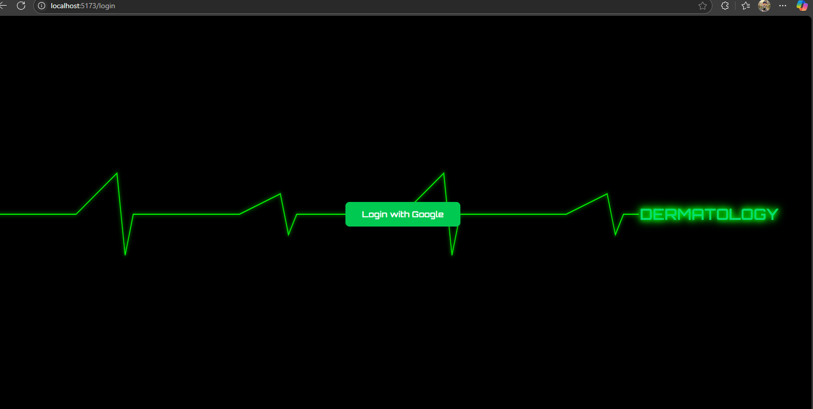
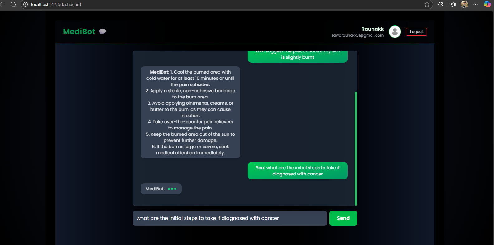

# 🩺 MediBot – Your AI-Powered Medical Chatbot

An intelligent medical chatbot built using **LangChain**, **Hugging Face Transformers**, **FAISS**, and **LLMs**, enhanced with modern **Google Authentication**, a **React frontend**, and **Express + MongoDB backend**. It provides intelligent, context-aware answers to medical queries using retrieval-augmented generation (RAG).

---

## 🚀 Features

- 💬 Conversational AI for medical questions
- 🔐 Secure Google Login via OAuth2
- 🧠 Context-aware answers using vector search (FAISS)
- 🧾 Retrieval-Augmented Generation (RAG)
- 🌐 Modern responsive frontend using React, Tailwind CSS & Framer Motion
- ⚙️ Modular and extendable backend using Express.js
- 🤗 Uses pretrained/fine-tuned LLMs from Hugging Face

---

## 📦 Tech Stack

### 🧠 AI & NLP
- [LangChain]
- [Hugging Face Transformers]
- [FAISS]

### 🖥️ Frontend
- [React]
- [Tailwind CSS]
- [Framer Motion]

### 🔐 Authentication & Backend
- [Express.js]
- [MongoDB]
- [Google OAuth2]

---

## 🧪 How It Works

1. **User logs in** with Google via the React frontend.
2. **Express backend** handles Google authentication and saves user data to **MongoDB**.
3. Once authenticated, users are redirected to the chatbot dashboard.
4. The **chatbot** interacts with the FastAPI server running a LangChain-based agent using FAISS + HuggingFace LLMs.
5. Responses are streamed back to the frontend for real-time user interaction.

---

## 🖼️ Screenshots

### 🔐 Login Page

### 💬 Chatbot Dashboard

